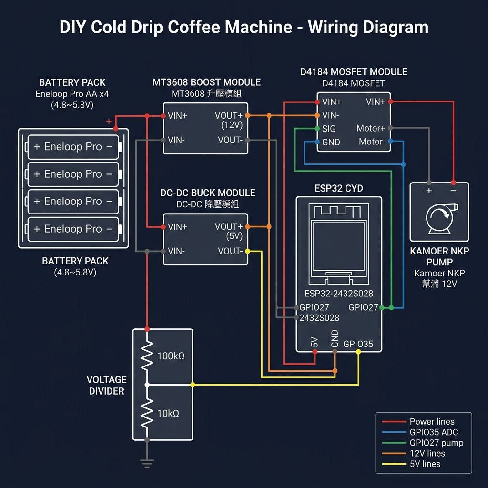

# ☕ 冰滴咖啡機控制器 (Cold Drip Coffee Controller)

> ESP32-CYD 驅動的 600ml / 6小時自動化冰滴咖啡系統

## 📋 專案概述

| 項目 | 規格 |
|------|------|
| **目標產量** | 600ml / 6小時 |
| **配置** | 左右並列雙槽結構（右側入水、左側萃取） |
| **控制器** | ESP32 CYD (ESP32-2432S028) |
| **運作模式** | 完全離線，無需 WiFi |
| **核心邏輯** | 間歇滴灌（預設每 60 秒啟動 2 秒） |

## 🔧 BOM 表 (物料清單)

| 類別 | 項目規格 | 用途 |
|------|----------|------|
| 控制器 | ESP32 CYD (ESP32-2432S028) | 系統大腦與資訊顯示 |
| 執行器 | Kamoer NKP 幫浦 (12V / BPT管) | 精準抽水，耐磨損 |
| 電源 | Eneloop Pro AA 電池 x 4 | 穩定、耐低溫電力來源 |
| 電壓轉換 | MT3608 升壓模組 (升至 12V) | 驅動幫浦專用 |
| 降壓件 | DC-DC 降壓模組 (降至 5V) | 供應 ESP32 運作 |
| 驅動件 | D4184 MOSFET 模組 | 隔離控制與動力電路 |
| 監測件 | 分壓電阻 (100kΩ / 10kΩ) | 實現電量百分比監測 |
| 耗材 | 3mm 食品級矽膠管 | 跨接兩側槽體之水路 |
| 結構 | PETG 3D 列印密封基座 | 防水、防潮、低重心設計 |

## ⚡ 接線圖



### GPIO 分配

| GPIO | 功能 | 方向 | 接往 |
|------|------|------|------|
| **GPIO27** | 幫浦控制 | OUTPUT | D4184 MOSFET SIG |
| **GPIO35** | 電壓監測 (ADC1_CH7) | INPUT | 分壓電阻中間點 |
| 5V | 電源輸入 | - | DC-DC 降壓 VOUT+ |
| GND | 共地 | - | 所有模組共地匯流排 |

### 接線重點

```
電池 (+) ──┬── MT3608 升壓 → 12V → D4184 → Kamoer NKP 幫浦
           ├── DC-DC 降壓 → 5V → ESP32 CYD
           └── 分壓電阻 (100kΩ + 10kΩ) → GPIO35 (ADC)
```

## 🖥️ 操作介面

### 主控頁面
- **狀態指示**: STANDBY / BREWING / PAUSED / COMPLETE / LOW BATT!
- **即時數據**: 已萃取量、已耗時、剩餘量、剩餘時間
- **進度條**: 萃取完成百分比
- **電池監測**: 電壓與百分比顯示
- **控制按鈕**: START / PAUSE / RESUME / STOP

### 設定頁面
- **滴灌間隔**: 10~300 秒，每次調整 ±10 秒
- **幫浦持續時間**: 500~5000 毫秒，每次調整 ±100 毫秒
- **流量預估**: 即時計算 ml/min 與總預估量

## 🛡️ 安全機制

| 保護類型 | 觸發條件 | 動作 |
|----------|----------|------|
| 低電量停機 | 電壓 < 4.0V | 自動停止幫浦並切換至 LOW BATT 狀態 |
| 低電量警告 | 電壓 < 4.4V | 電池圖示轉為琥珀色 |
| 電壓平滑 | - | 8 點滑動平均，避免瞬間干擾 |

## 📐 技術參數

- **控制頻率**: 預設每 60 秒啟動 2 秒
- **目標流量**: ~1.67 ml/min
- **總週期數**: 360 次 × 1.67ml ≈ 600ml
- **ADC 解析度**: 12-bit (0~4095)
- **電壓量測範圍**: 0~36.3V (分壓比 11:1)

## ⚙️ 編譯與燒錄

1. 安裝 [VS Code](https://code.visualstudio.com/) + [PlatformIO](https://platformio.org/) 插件
2. 開啟本專案資料夾
3. PlatformIO 會自動安裝依賴 (`TFT_eSPI`, `XPT2046_Touchscreen`)
4. 點擊 `Upload` 燒錄至 ESP32 CYD

## 📝 開發筆記

- **離線設計**: 此專案完全不需要 WiFi，適合冰箱冷藏環境
- **防水考量**: 電子艙建議密封並內置乾燥劑包，防止冷藏環境結露
- **局部刷新**: UI 採用局部更新策略，降低閃爍並節省電力
- **滑動平均**: 電池電壓使用 8 點滑動平均，過濾 ADC 雜訊

## ⚠️ 注意事項

- 首次使用前，建議先校準幫浦流量（調整 `PUMP_ON_DURATION_MS`）
- 確保分壓電阻焊接穩固，ADC 讀數偏差會影響電量計算
- PETG 基座需確保密封性，防止冷凝水滲入電子艙
- Eneloop Pro 在低溫環境下容量會略減，實際續航時間可能縮短
