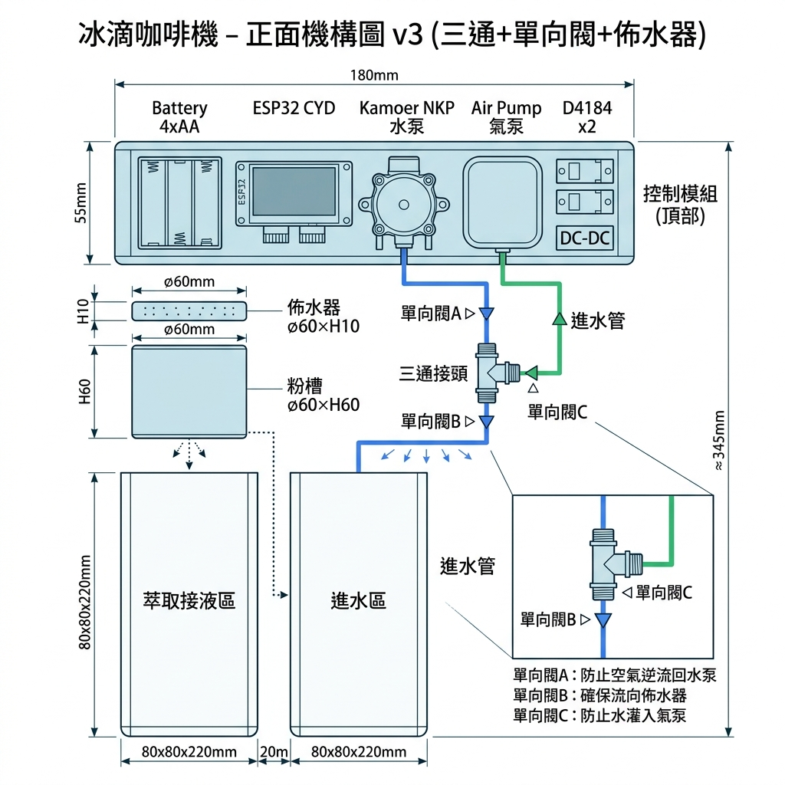
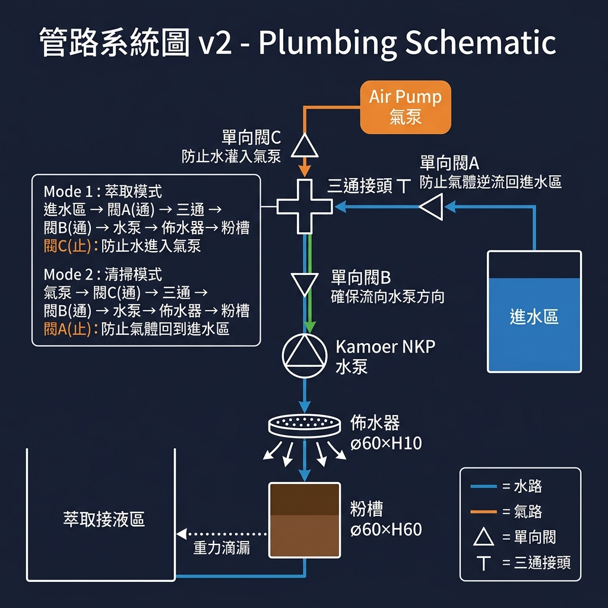
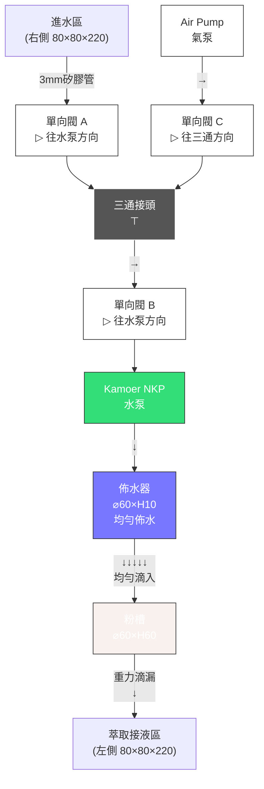

# 📐 冰滴咖啡機 - 機構設計與零件尺寸 v7 (v2.2 硬體)

> **ESP32-WROOM-32 核心** ｜ **1.28" 圓形 LCD** ｜ 佈水器均勻佈水 ｜ 三通+單向閥×3

---

## 零件尺寸總表

### 電子零件

| 零件 | 尺寸 (LxWxH mm) | 重量 | 備註 |
|------|-----------------|------|------|
| ESP32 DevKit V1 | 52 × 28 × 12 | ~12g | WROOM-32 模組 (30 pin) |
| 1.28" 圓形 LCD (GC9A01) | ⌀38 × 12 | ~10g | 顯示區域 ⌀32.4mm |
| Kamoer NKP 6V 蠕動幫浦 | 67 × 55 × 41 | ~110g | 含 L 型支架，3 rotor |
| 2 路繼電器模組 (5V) | 50 × 41 × 18 | ~30g | 低電平觸發，帶光耦 |
| 5A 帶電壓表降壓模組 | 66 × 39 × 18 | ~25g | XL4015 晶片，帶數碼管 |
| Eneloop Pro AA × 4 | — | ~120g | 4 顆 × 30g |
| EC11 旋轉編碼器 | 15 × 12 × 25 | ~5g | 含旋鈕蓋 |

### 管路零件

| 零件 | 規格 | 數量 | 備註 |
|------|------|------|------|
| 佈水器 | ⌀60 × H10mm 多孔圓盤 | 1 | 3D 列印或不鏽鋼，孔徑 1~2mm |
| 三通接頭 | 3mm 內徑 T 型接頭 | 1 | 水泵與氣泵管路匯流 |
| 單向閥 A | 3mm 內徑 | 1 | 進水區 → 三通 (往水泵方向) |
| 單向閥 B | 3mm 內徑 | 1 | 三通 → 水泵入口 (往水泵方向) |
| 單向閥 C | 3mm 內徑 | 1 | 氣泵 → 三通 (往三通方向) |
| 矽膠管 | ⌀3mm 食品級 (FDA/NSF) | ~600mm | 水路+氣路總長 |

### 結構零件

| 零件 | 尺寸 | 材質 | 備註 |
|------|------|------|------|
| 咖啡粉槽 | ⌀60 × H60 mm | PETG | 圓柱體，底部濾網 |
| 進水區容器 | 80 × 80 × H220 mm | PETG / 玻璃 | 右側 |
| 萃取接液區容器 | 80 × 80 × H220 mm | PETG / 玻璃 | 左側 |
| 控制模組平台 | 180 × 80 × H55 mm | PETG | 頂部蓋板式設計 |

---

## 正面機構圖
 


### 正面尺寸標註

```
                ← ─ ─ ─ 180mm ─ ─ ─ →
            ┌─────────────────────────────┐ ─┐
            │  控制模組 (電池/CYD/幫浦/氣泵) │  │ 55mm
            └─────────────────────────────┘ ─┘
                 │管路           │管路
            ┌────┤    三通+單向閥  ├───┐
            │    ↓               ↓    │
            │  ┌───┐                  │
            │  │佈水│ ⌀60×H10         │
            │  ├───┤ ─┐               │
            │  │粉槽│  │ 60mm         │
            │  │⌀60│  │               │
            │  └─┬─┘ ─┘               │
            ┌────┴───┐    ┌──────────┐ ─┐
            │        │    │          │  │
            │ 萃取區  │    │  進水區   │  │
            │        │    │          │  │ 220mm
            │ 80×80  │    │  80×80   │  │
            │        │    │          │  │
            └────────┘    └──────────┘ ─┘
            ← 80mm → 20mm ← 80mm →
```

**總高度**: 55 + 10 + 60 + 220 = **345mm**
**總寬度**: 80 + 20 + 80 = **180mm**
**總深度**: **80mm**

---

## 管路系統圖



### 管路連接詳細



### 兩種工作模式

````carousel
#### 🔵 萃取模式 (Brewing)
```
進水區 → 單向閥A(通) → 三通 → 單向閥B(通) → 水泵 ON → 佈水器 → 粉槽 → 萃取區
                         ↑
               單向閥C(止) ← 氣泵 OFF (水被阻擋，不會灌入氣泵)
```
- 水泵從右側進水區抽水（經三通進入水泵入口）
- 水流方向：進水區 → 閥A → 三通 → 閥B → 水泵 → 佈水器 → 粉槽
- 單向閥C 阻止水灌入氣泵
- 萃取液從粉槽底部濾網重力滴入左側接液區
<!-- slide -->
#### 🟠 清掃模式 (Air Purge)
```
               單向閥A(止) ← 氣體被阻擋，不會逆流回進水區
                         ↓
氣泵 ON → 單向閥C(通) → 三通 → 單向閥B(通) → 水泵 ON → 佈水器 → 粉槽
```
- 氣泵吹入空氣，經單向閥C 進入三通
- 單向閥A 阻止氣體逆流回進水區
- 氣體經閥B → 水泵（輔助推動）→ 佈水器 → 粉槽
- 將管路和粉槽中的殘留水吹出
````

### 單向閥功能對照表

| 單向閥 | 位置 | 流向 | 萃取時 | 清掃時 | 保護對象 |
|--------|------|------|--------|--------|----------|
| **A** | 進水區 → 三通 | → 往水泵方向 | ✅ 通 (水流通過) | ❌ 止 (阻擋氣體逆流) | 進水區不灌入空氣 |
| **B** | 三通 → 水泵入口 | → 往水泵方向 | ✅ 通 (水流通過) | ✅ 通 (空氣通過) | 確保流向進入水泵 |
| **C** | 氣泵 → 三通 | → 往三通方向 | ❌ 止 (阻擋水) | ✅ 通 (空氣通過) | 氣泵不灌入水 |

---

## 控制模組平台佈局 (180mm × 80mm)

```
← ─ ─ ─ ─ ─ ─ ─ ─ 180mm ─ ─ ─ ─ ─ ─ ─ ─ →
┌──────────┬───────────┬──────────┬─────────┐ ─┐
│ 電池座    │ ESP32 DevKit│ Kamoer   │ Air Pump│  │
│ 62×57    │ 52×28     │ NKP      │ 30×30   │  │
│          │           │ 67×55    │─────────│  │ 80mm
│ [四顆AA] │ [圓形 LCD] │ ○ 泵頭   │ 2路繼電器│  │
│          │    ○      │          │ 50×41   │  │
│          │ [降壓模組]  │          │         │  │
└──────────┴───────────┴──────────┴─────────┘ ─┘
```

> [!TIP]
> **佈置策略**：ESP32 DevKit V1 的體積比 S3 稍微寬一點點，在佈線時需預留空間。降壓模組（XL4015）與繼電器模組置於兩側，方便直接接線。

---

## 管路長度估算

| 管段 | 起點 | 終點 | 長度 (約) |
|------|------|------|-----------|
| 進水管 | 進水區底部 | 單向閥A 入口 | ~250mm |
| 閥A → 三通 | 單向閥A 出口 | 三通入口 | ~20mm |
| 氣泵管 | Air Pump 出口 | 單向閥C 入口 | ~30mm |
| 閥C → 三通 | 單向閥C 出口 | 三通側口 | ~20mm |
| 三通 → 閥B | 三通出口 | 單向閥B 入口 | ~20mm |
| 閥B → 水泵 | 單向閥B 出口 | Kamoer NKP 入口 | ~30mm |
| 水泵 → 佈水器 | Kamoer NKP 出口 | 佈水器入口 | ~100mm |
| **矽膠管總長** | — | — | **~470mm** |

---

## 冰箱適配性

```
一般家用冰箱冷藏區：
  寬度: 50~60cm  → 機器 18cm ✅ 充裕
  深度: 40~50cm  → 機器  8cm ✅ 充裕  
  高度: 30~35cm  → 機器 34.5cm ⚠️ 偏緊

建議：
  ✅ 放置在冷藏區最高層（通常空間最大）
  ✅ 若空間不足，容器高度可調整為 200mm → 總高度降至 325mm
```

---

## 3D 列印建議

| 部件 | 材質 | 填充率 | 壁厚 | 說明 |
|------|------|--------|------|------|
| 控制模組外殼 | PETG | 30% | 2mm | 需密封防潮 |
| 佈水器圓盤 | PETG | 100% | — | 實心印刷，鑽 1~2mm 孔 |
| 粉槽外殼 | PETG | 40% | 2.5mm | 需承重，接觸食品 |
| 粉槽支架 | PETG | 50% | 3mm | 承重結構件 |

> [!IMPORTANT]
> 佈水器建議列印後手動鑽孔（⌀1~2mm × 12~16孔），比直接列印小孔更精確。孔位採用同心圓排列，確保水均勻分布。

> [!TIP]
> 進水區和萃取區建議使用現成的**玻璃方瓶** (接近 80×80×220mm)，比 3D 列印更衛生、透明可觀察液位。
